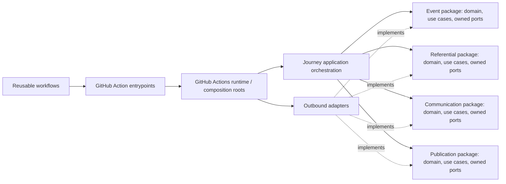
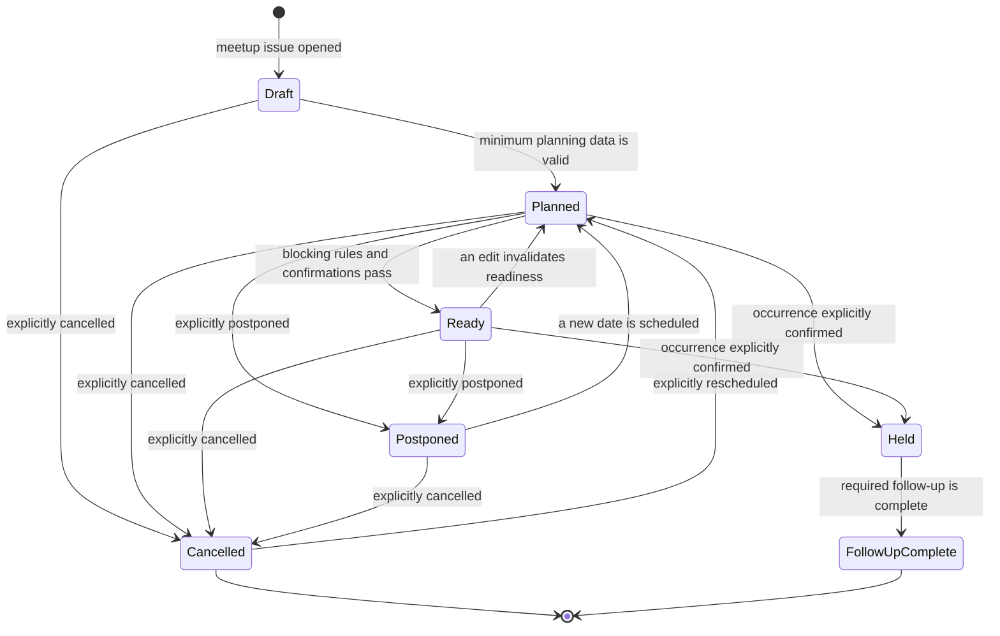
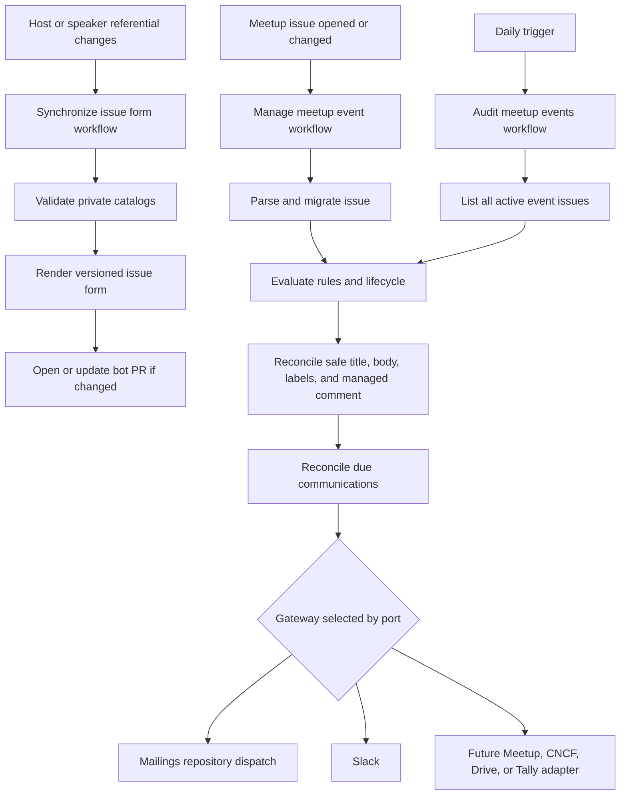

# ADR-0001: Centralize the meetup event journey in the automation repository

- Status: Accepted
- Date: 2026-09-04
- Owners: Cloud Native Aix-Marseille maintainers
- Scope: `meetup-event-automation` and `meetups`
- Supersedes: None

Implementation follow-up: [Google Drive event assets](../publication-assets.md)
adds the publication-owned asset use case, `google-drive-asset-repository`, and
`actions/publication/reconcile-assets` anticipated by this decision. The initial
manual asset task remains the fallback when the optional credentials are absent.

## Context

The meetup journey is currently split across two repositories.

`meetup-event-automation` owns one Node.js action. It receives an already
parsed issue body and host/speaker lists, fetches the corresponding GitHub
issue, runs validation and normalization rules, optionally updates the issue,
and returns newline-delimited linting errors.

`meetups` owns the event data, but it also owns most of the automation:

- the GitHub issue form and host/speaker CSV referentials;
- issue-form parsing and referential loading;
- active-issue discovery and readiness evaluation;
- issue-update and scheduled orchestration;
- lint-comment reconciliation;
- issue-form generation from referentials;
- planned Slack and email communication behavior.

This makes `meetups` both a data repository and the implementation of the
meetup journey. Business rules are distributed between TypeScript, composite
actions, workflow expressions, shell, and inline JavaScript. They cannot be
tested or versioned as one coherent product.

The local `ci/communication-v2` branch in `meetups` demonstrates the intended
introduction, reminder, and thank-you flows, but is not an implementation to
move unchanged. It contains broken action paths and scripts, does not persist
delivery idempotency, and could send the same communication repeatedly.

The current model has additional structural problems:

- `MeetupIssue` mixes the meetup model with its GitHub Issue projection.
- Classes called `*LinterAdapter` are business rules, while actual external
  adapters are hidden in generic services.
- Domain behavior depends directly on `@actions/*`, Inversify decorators,
  issue-form Markdown headings, and mutable GitHub-shaped objects.
- Referential reads use GitHub's default branch instead of necessarily reading
  the checked-out revision, and debug logs may expose contact data.
- Active-issue discovery is not paginated.
- The newest issue-form template is used to parse historical issues without an
  explicit schema version or migration policy.
- Time-based rules use runner time instead of the configured community time
  zone.
- The public action contract is too low-level: the consumer must parse the
  issue and assemble several inputs before calling it.

The target structure takes inspiration from:

- `ci-dokumentor`: a pnpm/Nx TypeScript workspace with explicit package
  boundaries, inward-facing ports, replaceable adapters, per-package tests,
  and thin delivery entrypoints;
- `ci-github-nodejs`: independently addressable actions under `actions/`,
  public reusable workflows under `.github/workflows/`, `__`-prefixed internal
  test/orchestration workflows, generated component documentation, immutable
  dependency pins, and direct or workflow-level contract tests for actions and
  reusable workflows.

We borrow these mechanics, not their technical package boundaries. This
repository is organized by meetup business domain first.

## Decision drivers

1. `meetup-issue-linter-action` must be the only implementation of meetup
   journey behavior.
2. `meetups` must remain the owner of community data, event instances,
   credentials, permissions, and GitHub triggers.
3. Business rules must be deterministic and testable without GitHub or network
   access.
4. GitHub Issues, CSV, Slack, and the mailings repository must be replaceable
   through ports and adapters.
5. Event-triggered and scheduled runs must be safe to retry and safe to run
   concurrently.
6. Historical issues and configuration must evolve through versioned schemas.
7. Public actions and workflows must have small, documented, versioned
   contracts.
8. Contact data must never be copied into the public automation repository,
   logs, summaries, artifacts, or public action outputs.
9. Workflow permissions and secrets must be explicit and least-privileged.

## Decision

`meetup-issue-linter-action` becomes the meetup automation product (the
"brain"). It will contain:

- a pnpm/Nx TypeScript workspace;
- one workspace package per business domain;
- application orchestration and explicit ports;
- replaceable outbound adapter packages;
- thin GitHub Action entrypoints;
- public reusable workflows for the complete event journey;
- unit, contract, integration, action, and workflow tests;
- generated documentation for every public action and workflow.

`meetups` becomes a declarative consumer. It retains:

- event issues and their history;
- the generated issue form required by GitHub;
- private host and speaker referentials;
- one minimal, versioned safety configuration file;
- repository variables and secrets;
- small trigger-only workflows that call the brain at an immutable revision.

The historical repository name remains during the migration to avoid breaking
existing references. Renaming the repository is outside this decision. The
published surface is limited to dedicated Actions under `actions/` and public
reusable workflows under `.github/workflows/`.

## Responsibility boundary

| Concern                            | Brain: `meetup-issue-linter-action`              | Consumer: `meetups`                           |
| ---------------------------------- | ------------------------------------------------ | --------------------------------------------- |
| Meetup aggregate and lifecycle     | Owns model, rules, use cases                     | Stores event instances as issues              |
| Validation and normalization       | Owns                                             | No executable rules                           |
| Readiness and label policy         | Owns conventions                                 | Uses brain-owned labels                       |
| Issue parsing/rendering/migrations | Owns codecs and migrations                       | Stores generated issue form                   |
| Referential behavior               | Owns schema, parsing, deduplication, resolution  | Stores private CSV records                    |
| Communication policy               | Owns eligibility, content, idempotency           | Enables dispatch and supplies credentials     |
| External integrations              | Owns adapters, routing conventions, destinations | Supplies credentials and fixed-name variables |
| Actions and journey orchestration  | Publishes                                        | Consumes pinned versions                      |
| GitHub triggers                    | Defines required caller contract                 | Owns event, schedule, and path triggers       |
| Permissions                        | Documents minimum contract                       | Grants them explicitly                        |
| Secrets and PII                    | Uses ephemerally and redacts                     | Owns and stores                               |
| Generic repository maintenance     | Out of scope                                     | Keeps greetings, stale, generic CI, etc.      |

Reusable workflows cannot subscribe to events in another repository. A few
caller workflow files must therefore remain in `meetups`; they contain triggers
and delegation only, not meetup policy.

## Target workspace

The workspace uses pnpm for workspace dependency management and Nx for the
project graph, affected builds, caching, and dependency-aware tasks. TypeScript
is strict. Vitest is the test runner, Biome formats/lints, and esbuild produces
the committed Node.js action bundles.

```text
meetup-issue-linter-action/
├── package.json
├── pnpm-lock.yaml
├── pnpm-workspace.yaml
├── nx.json
├── tsconfig.base.json
├── vitest.config.ts
├── packages/
│   ├── domain/
│   │   ├── event/
│   │   ├── referential/
│   │   ├── communication/
│   │   └── publication/
│   ├── application/
│   │   └── journey/
│   ├── adapter/
│   │   ├── github-event-repository/
│   │   ├── github-event-comment-repository/
│   │   ├── github-issue-form-event-document-codec/
│   │   ├── github-communication-approval-repository/
│   │   ├── github-delivery-ledger/
│   │   ├── csv-referential-repository/
│   │   ├── yaml-issue-form-projection/
│   │   ├── yaml-automation-config-repository/
│   │   ├── github-repository-dispatch-mail-gateway/
│   │   ├── slack-notification-gateway/
│   │   └── system-clock/
│   └── runtime/
│       └── github-actions/
├── actions/
│   ├── event/
│   │   ├── reconcile/
│   │   │   ├── action.yml
│   │   │   ├── README.md
│   │   │   └── dist/index.js
│   │   └── list-active/
│   │       ├── action.yml
│   │       ├── README.md
│   │       └── dist/index.js
│   ├── referential/
│   │   ├── validate/
│   │   └── sync-issue-form/
│   └── communication/
│       └── reconcile/
├── .github/workflows/
│   ├── manage-meetup-event.yml
│   ├── manage-meetup-event.md
│   ├── audit-meetup-events.yml
│   ├── audit-meetup-events.md
│   ├── synchronize-meetup-issue-form.yml
│   ├── synchronize-meetup-issue-form.md
│   ├── validate-meetup-automation.yml
│   ├── validate-meetup-automation.md
│   └── __shared-ci.yml
├── tests/
│   └── contracts.spec.ts      # All public Action/workflow contracts
├── docs/adr/
└── packages/
```

Every domain package follows the same internal shape:

```text
packages/domain/<domain>/
├── package.json
├── src/
│   ├── domain/                # Entities, value objects, policies, events
│   ├── application/
│   │   ├── ports/             # Interfaces required by use cases
│   │   └── use-cases/
│   └── index.ts               # The only supported package API
├── __tests__/                 # Builders, fakes, and contract fixtures
├── tsconfig.lib.json
├── tsconfig.spec.json
└── vitest.config.ts
```

Packages are private workspace packages. GitHub Actions and reusable workflows,
not npm packages, are the public delivery surface. A package is published only
if a separate decision identifies a real external TypeScript consumer.

Adapter packages follow `<technology>-<responsibility>`. A bare technology name
such as `github`, `csv`, or `slack` is forbidden because it does not communicate
which port the adapter implements. When one technology fulfills unrelated
responsibilities, each responsibility has a separate package—for example,
`github-event-repository`, `github-communication-approval-repository`,
`github-delivery-ledger`, and `slack-notification-gateway`.

### Dependency rule

Dependencies always point inward:



Each bounded-context package owns both its domain model and its application
API: use cases plus narrowly named ports. `packages/application/journey` only
coordinates those public APIs; it does not redefine their ports or business
rules. Every port has exactly one owning package, although one
responsibility-named adapter package may implement multiple structurally
compatible ports, as `system-clock` does for the two clock ports.

The following rules are enforced by workspace architecture tests in CI:

- domain code imports neither adapter/runtime packages nor `@actions/*`,
  Octokit, filesystem, YAML, CSV, Slack, or system time;
- application use cases depend on domain types and ports, never concrete
  adapters;
- adapters implement a specifically owned port and may depend on vendor SDKs;
- action entrypoints only parse inputs, build a composition root, call one use
  case, and serialize a result;
- reusable workflows orchestrate actions and permissions; they contain no
  business JavaScript or shell conditions;
- package consumers import only a package's `index.ts` exports; deep imports
  and circular dependencies fail CI;
- there is no generic `utils`, `helpers`, or `shared` package. A shared kernel
  will be introduced only for a proven stable concept used unchanged by more
  than one domain.

Inversify may remain in runtime composition, but decorators and the container
must not leak into domain objects. Constructor injection and small explicit
interfaces are preferred.

## Domains

### Event domain

Package: `packages/domain/event`

The `MeetupEvent` aggregate is independent of GitHub. It owns:

- event identity, title, description, date, and configured time zone;
- host reference and agenda entries with speaker references;
- logistics such as aperitif and post-event venue intent;
- operational checklists for slides/content and follow-up;
- readiness facts, label-driven occurrence status, and the derived lifecycle state;
- validation diagnostics and safe normalization patches.

Application use cases include:

- `ReconcileEvent`: parse facts, evaluate rules, and return diagnostics plus an
  immutable projection/patch;
- `EvaluateReadiness`: distinguish invalid, incomplete, and ready events;
- `ListActiveEvents`: request all relevant events through a paginated port;
- `EvaluateLifecycle`: derive state from an explicit instant and time zone
  supplied by the application through the event package's `EventClock` port.

The current field-specific linter classes become `EventRule` policies. They are
not called adapters because they do not cross a technology boundary. Rules may
declare ordering dependencies, but startup validation rejects missing or
cyclic dependencies instead of discovering them through recursion at runtime.

`should-fix` is not a domain concern. A rule returns diagnostics and proposed
patches; the application use case decides whether a selected execution mode
may persist them.

### Referential domain

Package: `packages/domain/referential`

This domain owns `Host`, `Speaker`, stable referential identifiers, contact
validation, normalization, deduplication, and lookup semantics. It exposes use
cases to validate a catalog, resolve the host/speakers referenced by an event,
and create the redacted choice projection used by the issue form.

The current CSV format has no stable identifiers, repeats organizations when
they have multiple contacts, and can contain distinct speakers with the same
display name. The target data contract therefore adds:

- `host_id` and `contact_id` columns to the hosting catalog. Rows with the same
  `host_id` form one organization with multiple contacts, and the first row is
  the operational communication contact;
- `speaker_id` column to the speaker catalog;
- an invariant that identifiers are immutable and unique, while display names
  need not be unique;
- one communication intent for the first stored contact of a host, so
  multi-contact hosts remain possible without a separate opt-in flag.

Bootstrap tooling proposes IDs for existing rows, maintainers review them, and
IDs are never regenerated from a later name. New issue projections retain
friendly display names but persist resolved IDs in brain-managed issue
metadata. If a free-form legacy name resolves to more than one record, the
action reports an ambiguity and requires an explicit ID; it does not guess.
The generated issue form exposes the accepted `Display name [stable_id]`
syntax wherever ambiguity is possible.
Existing CSV line links are treated only as legacy presentation data because a
line number is not a stable identity.

The brain owns these schemas in TypeScript and their synthetic fixtures. Once
the replacement validation action is active, the consumer's
`hosting.schema.yml` and `speakers.schema.yml` files and CSV Blueprint job are
deleted. The actual CSV records remain in `meetups`.

Public event DTOs may expose display names already intended for the meetup
issue. Private contact data—email addresses, phone numbers, private addresses,
and contact-only names—may exist only inside the referential/communication
runtime boundary and approved downstream processors.

### Communication domain

Package: `packages/domain/communication`

This domain owns communication intent, not Slack or email APIs. It models:

- host and speaker introduction messages;
- near-event readiness reminders;
- post-event thank-you messages;
- recipient roles, templates, delivery status, and deterministic idempotency
  keys;
- the policies that decide whether a communication is due.

`PlanCommunications` is a pure use case. While the official workflow holds the
shared per-event concurrency lock, `ReconcileCommunications` compares the plan
with a `DeliveryLedger`, persists each missing intent as `pending`, dispatches
it with the same idempotency key, and transitions it to `accepted` only after
gateway acknowledgement. An ambiguous response becomes `uncertain` and is
never automatically resent; an operator must reconcile it.

Planning is independent of gateway credentials. Check mode therefore reports
the complete business plan even when optional mail or Slack secrets are not
available. In dispatch mode, runtime capabilities suppress reservation and
gateway invocation for an unavailable channel without removing its due intents
from the plan.

The mailings repository/provider must accept and deduplicate the idempotency key
before email dispatch is enabled. Slack does not provide an exactly-once
guarantee, so a reserved `pending`/`uncertain` Slack intent favors avoiding a
duplicate over an automatic retry. The result envelope reports this state for
manual resolution.

A `scheduled` event whose civil date has elapsed produces no introduction or
thank-you intent. Passage of time is not occurrence evidence; maintainers must
set the explicit `held` status before thank-you messages become eligible.

An unchecked issue checkbox is a human-facing projection, not proof that a
message has never been sent. A stable idempotency key includes repository,
event identity, communication kind, recipient identity, and policy version.
Recipient contact data is not part of the key.

### Publication domain

Package: `packages/domain/publication`

This domain owns external event publication and post-event exchange:

- Meetup and CNCF/OCGroups event references;
- Drive folder and slide publication state;
- attendance import/export state;
- explicit manual tasks where no adapter exists yet.

In the first migration, this package replaces the hardcoded Meetup, CNCF, and
Drive URL rules and models the existing manual checklist. Later adapters may
create/update external events, share slides, and synchronize Tally attendance
without changing the event or communication domains.

### Lifecycle

Lifecycle state is derived from event facts; it is not a second mutable source
of truth. Existing issue labels and checkboxes are projections of this state
during migration. Operational labels drive exceptional transitions:
`event:postponed` and `event:cancelled` are explicit overrides, while a closed
issue implies `held` unless an explicit occurrence label says otherwise. Date
passage alone never proves that an event was held, and closing a GitHub issue
never means that it was cancelled.



GitHub Issue `open`/`closed` is repository metadata outside this business state
machine, but the automation uses `closed` as the default signal that an event
occurred when no explicit occurrence label is present. An issue may still be
closed or reopened in any lifecycle state; explicit occurrence labels remain
authoritative. Thank-you eligibility therefore still depends on a derived or
explicit `held` status, not on date passage alone.

Old or manually edited issues may still contain the legacy `Event Status`
section. The evaluator must still parse them, prefer explicit occurrence labels
when present, and tolerate historical issue bodies during migration rather than
failing the whole scheduled run.

The application layer emits facts such as `EventChanged`, `EventBecameReady`,
`EventDueSoon`, `EventDateElapsed`, `EventHeld`, `EventCancelled`, and
`FollowUpCompleted`. These are in-process domain events/values, not a
requirement for a message broker. Communication and publication policies
consume them without being imported by the event domain.

## Ports and adapters

Ports are owned by the application/domain package that needs them. Concrete
implementations live outside domain packages.

| Port                              | Owning package | Initial adapter package                    | Replaceable/future adapter             |
| --------------------------------- | -------------- | ------------------------------------------ | -------------------------------------- |
| `EventRepository`                 | Event          | `github-event-repository`                  | Another issue-tracker event repository |
| `EventDocumentCodec`              | Event          | `github-issue-form-event-document-codec`   | Another event-document codec           |
| `EventCommentRepository`          | Event          | `github-event-comment-repository`          | No-op event-comment repository         |
| `EventClock`                      | Event          | `system-clock`                             | Fixed event clock                      |
| `ReferentialRepository`           | Referential    | `csv-referential-repository`               | Airtable referential repository        |
| `CommunicationClock`              | Communication  | `system-clock`                             | Fixed communication clock              |
| `CommunicationApprovalRepository` | Communication  | `github-communication-approval-repository` | Another trusted approval store         |
| `DeliveryLedger`                  | Communication  | `github-delivery-ledger`                   | Transactional delivery ledger          |
| `MailGateway`                     | Communication  | `github-repository-dispatch-mail-gateway`  | Direct-provider mail gateway           |
| `NotificationGateway`             | Communication  | `slack-notification-gateway`               | Another notification gateway           |
| `EventPublisher`                  | Publication    | Manual projection; no adapter initially    | `meetup-event-publisher`               |
| `CommunityEventPublisher`         | Publication    | Manual projection; no adapter initially    | `ocgroups-community-event-publisher`   |
| `AssetRepository`                 | Publication    | Manual task; no adapter initially          | `google-drive-asset-repository`        |
| `AttendanceGateway`               | Publication    | Manual task; no adapter initially          | `tally-attendance-gateway`             |
| `IssueFormProjection`             | Journey        | `yaml-issue-form-projection`               | Another intake-form projection         |
| `AutomationConfigRepository`      | Journey        | `yaml-automation-config-repository`        | Another configuration repository       |

Adapter contracts use domain values and typed results; vendor response objects
must not cross the adapter boundary. All remote adapters define pagination,
retry classification, rate-limit behavior, and idempotency semantics.
The repository-dispatch mail adapter treats HTTP 429, plus HTTP 403 carrying a
numeric `Retry-After` or zero `X-RateLimit-Remaining` header, as safely deferred;
it never inspects or publishes provider exception messages to classify them.

The initial `github-delivery-ledger` adapter has no compare-and-set primitive.
Its reservation guarantee therefore depends on the shared, non-cancelling
workflow concurrency lock, and dispatch outside the official workflows is
unsupported. If another independent dispatcher is introduced, it first
requires a transactional delivery-ledger adapter with conditional unique
writes.

GitHub Issue rendering is a projection. The `MeetupEvent` aggregate never edits
Markdown headings directly. A versioned codec parses the issue body, migrates
older representations, and renders a minimal patch.

GitHub Issue Form `markdown` blocks are not a reliable way to put hidden data
in a submitted issue body. The event reconcile action therefore treats an
unmarked issue as legacy schema `0` and, in `fix` mode, writes a managed marker
such as `<!-- meetup-event-schema:1 -->` directly into the issue body. The
marker and stable referential-ID metadata are preserved by subsequent renders;
they are not sourced from a display-only issue-form block.

Managed diagnostic, communication-approval, and delivery-ledger comments are
trusted only when their author matches the GitHub App bot login returned by
the token action. Marker text written by another issue commenter is ignored
and cannot forge state. Delivery-ledger identifiers are stored as SHA-256
digests, so stable recipient identifiers do not become public through issue
comments.

Outbound communication also requires the conventional approval label and a
matching App-owned snapshot of every event fact that affects eligibility,
recipients, routing, or message content. It contains no contact data: the
consumer checkout revision conservatively binds private referential changes,
while policy version, mailings repository, Slack enablement, and a SHA-256
digest of the Slack destination ID are explicit facts. The snapshot is written only for an actual
`labeled` event performed by an actor with at least triage permission, and only
when the immutable issue snapshot in that webhook still matches the issue used
to build the plan. A later issue edit never refreshes it merely because the
label remains: mismatched facts block dispatch until a maintainer removes and
re-adds the approval label.
Snapshot capture occurs only during a fully authorized `dispatch` reconciliation;
`check` mode remains mutation-free even when invoked by the label event.

## Public actions

Actions are thin inbound adapters. Each public action directory contains an
`action.yml`, generated `README.md`, and committed `dist/index.js`. Source and
composition roots live in `packages/runtime/github-actions`; inline workflow
JavaScript is not the implementation of a use case.

| Action                                | Responsibility                                                                         | Main inputs                                                             | Main outputs                                                          | Passed-token/API capability                        |
| ------------------------------------- | -------------------------------------------------------------------------------------- | ----------------------------------------------------------------------- | --------------------------------------------------------------------- | -------------------------------------------------- |
| `actions/event/reconcile`             | Load one issue, parse/migrate, validate, normalize, project title/body/labels/comments | issue number, mode, GitHub token, managed author                        | `result`, `state`, `is-ready`, `diagnostics`                          | `issues: read`, or `issues: write` in fix mode     |
| `actions/event/list-active`           | Return every active meetup issue using pagination and lifecycle filters                | GitHub token                                                            | `issue-numbers`                                                       | `issues: read`                                     |
| `actions/referential/validate`        | Validate referential schemas and cross-record invariants without exposing records      | None                                                                    | `result`, `is-valid`, redacted counts, `diagnostics`                  | None after checkout                                |
| `actions/referential/sync-issue-form` | Render referential choices and the occurrence-status field into the checked-out form   | mode                                                                    | `changed`, `changed-files`, `diagnostics`                             | None after checkout                                |
| `actions/communication/reconcile`     | Plan, reserve, dispatch, and record due messages for one event                         | issue number, mode, gateway credentials, managed author, lock assertion | redacted `result`, `planned-count`, `dispatched-count`, `diagnostics` | `issues: write` for ledger plus gateway credential |

Repository paths, labels, policy constants, external repository routes, and
the Slack destination variable name are not Action inputs. They are
brain-owned conventions. The two remaining `mode` inputs exist only where the
same internal Action serves read-only and mutating reusable workflows.

The final column describes the credential passed to that action, not the
caller's `GITHUB_TOKEN`. Checkout permissions and GitHub App installation-token
scopes are separate workflow concerns described below.

`mode` is an enum validated at the boundary:

- `check`: calculate and report without mutation;
- `fix`: apply safe issue/template projections;
- `dispatch`: apply projections and deliver due communications.

An action must reject a mode it does not support. Tests and pull requests use
`check`; production workflows select the narrowest mutating mode they require.
`actions/communication/reconcile` supports direct use only in `check` mode.
Its `dispatch` mode is an internal workflow building block and is supported
only while one of the brain's reusable workflows holds the shared per-event
concurrency group.

All new actions return a versioned JSON result envelope. GitHub Action outputs
remain strings, so JSON encoding happens only at the boundary.

```json
{
  "schemaVersion": 1,
  "status": "ok",
  "diagnostics": [
    {
      "code": "event.hoster.missing",
      "severity": "warning",
      "field": "hoster",
      "message": "A host must be selected",
      "fixApplied": false
    }
  ]
}
```

Expected business diagnostics do not fail the action. Invalid configuration,
invalid secrets, adapter failures, or corrupted data do fail it. Consumers
interact through the dedicated Actions and reusable workflows published by this
repository.

The initial publication package is exercised through event reconciliation.
Dedicated `actions/publication/*` entrypoints will be added only when an
external publication operation exists; empty facade actions are not created.

## Public reusable workflows

Public workflows have stable unprefixed filenames and adjacent generated
Markdown documentation. Files prefixed with `__` are repository-internal by
convention. The prefix is not an access-control mechanism.

| Workflow                            | Consumer trigger                    | Brain responsibility                                                                                                 |
| ----------------------------------- | ----------------------------------- | -------------------------------------------------------------------------------------------------------------------- |
| `manage-meetup-event.yml`           | Relevant issue events               | Checkout caller; authenticate; suppress recursion; reconcile event/comment; dispatch eligible communications         |
| `audit-meetup-events.yml`           | Daily or manual                     | Checkout caller; list active events; run matrix readiness/follow-up policies; reconcile communications; summarize    |
| `synchronize-meetup-issue-form.yml` | Referential/config change or manual | Checkout caller; validate referentials; render and test issue form; open/update a bot pull request only when changed |
| `validate-meetup-automation.yml`    | Consumer pull request               | Read-only referential validation and issue-form projection drift check                                               |

All four workflows expose zero ordinary caller inputs. The manage workflow
derives the issue number from the issue event. App identity and Slack routing
use the fixed repository variable names `CI_BOT_APP_ID` and
`SLACK_CHANNEL_ID`. Synchronization opens a pull request only when drift is
detected. Communication reconciliation always evaluates dispatch, while the
configuration switch, maintainer approval, credentials, and delivery ledger
remain fail-closed gates. The three mutating/operational workflows declare
their required GitHub App private key and optional delivery secrets explicitly.

Each workflow starts with `permissions: {}` and declares permissions per job.
It declares every `workflow_call` secret and output. `secrets: inherit`
is forbidden for consumer calls. Optional secrets are detected inside a step or
action through an environment value; they are never referenced directly in an
`if:` expression.

### Same-revision action loading

Relative action paths inside a called reusable workflow can resolve against the
caller's checkout, not automatically against the repository/revision that owns
the called workflow. Public workflows must therefore bootstrap the brain's
`actions/` directory at the exact workflow revision before using local action
paths. This repository uses the dedicated
`hoverkraft-tech/ci-github-common/actions/local-workflow-actions` helper to
expose that same-revision `actions/` directory under `../self-workflow`, then
invokes the local actions from that sibling path.

This rule prevents a workflow pinned to one revision from accidentally running
an action copied from `meetups` or from a different release. Direct
`./.github/actions/...` references to consumer-owned meetup actions are
forbidden in the target workflows.

## End-to-end journey



Both issue-event and scheduled paths call the same application use cases. They
must produce the same result for the same event, configuration, clock, and
delivery ledger.

## Consumer contract

`meetups` does not provide a meetup-specific runtime configuration file.

The brain fixes Europe/Paris, the `meetup` and confirmation labels, both
referential paths, the issue-form path and field IDs, the seven-day window,
approval label, mailings repository, Slack enablement, delivery policy version,
and publication URL policies. Secret values and contact records remain outside
the public caller workflow surface.

The issue trigger becomes a thin caller similar to:

```yaml
name: Manage meetup event

on:
  issues:
    types:
      [
        opened,
        edited,
        reopened,
        assigned,
        unassigned,
        labeled,
        unlabeled,
        closed,
      ]

permissions: {}

jobs:
  manage:
    uses: cloud-native-aixmarseille/meetup-issue-linter-action/.github/workflows/manage-meetup-event.yml@0123456789abcdef0123456789abcdef01234567 # 1.x.y
    permissions:
      contents: read
    secrets:
      github-app-private-key: ${{ secrets.CI_BOT_APP_PRIVATE_KEY }}
      slack-token: ${{ secrets.SLACK_BOT_TOKEN }}
```

The scheduled and referential workflows follow the same shape:

```yaml
jobs:
  audit:
    uses: cloud-native-aixmarseille/meetup-issue-linter-action/.github/workflows/audit-meetup-events.yml@0123456789abcdef0123456789abcdef01234567 # 1.x.y
    # Explicit permissions and secrets only; no workflow inputs.

  synchronize:
    uses: cloud-native-aixmarseille/meetup-issue-linter-action/.github/workflows/synchronize-meetup-issue-form.yml@0123456789abcdef0123456789abcdef01234567 # 1.x.y
    # Explicit permissions and secrets only; no workflow inputs.
```

After migration there is no meetup-specific JavaScript, composite action, or
business expression under `meetups/.github/actions` or its caller workflows.

## Idempotency, concurrency, and time

- Event reconciliation compares desired and current projections and writes
  only a minimal patch after a best-effort source-snapshot preflight. The
  current adapter has no transactional compare-and-set primitive, so the
  workflow lock serializes automation but cannot eliminate the
  final race with a human edit; a future repository adapter should use a
  conditional write if the provider exposes one.
- Exactly one managed diagnostic comment exists per event. It is updated or
  minimized deterministically; identical diagnostics cause no write.
- While the shared workflow lock is held, communication dispatch persists
  `pending` in the ledger before calling a gateway and records `accepted` on
  acknowledgement. A `pending` or `uncertain` intent is never automatically
  resent.
- Communication builds an immutable plan from one issue document, verifies a
  label webhook carried that same snapshot before recording approval, and
  reloads the issue before approval persistence and again before delivery. An
  edit detected at either boundary fails closed; any later race can only leave
  the already-approved immutable plan in memory, not substitute edited facts.
- The per-event jobs in `manage-meetup-event.yml` and the audit matrix use the
  same repository-scoped group, for example
  `meetup-event-<repository-id>-<issue-number>`. Side-effecting jobs use
  `cancel-in-progress: false`; cancellation is allowed only for pure `check`
  runs.
- GitHub concurrency does not guarantee ordering and may coalesce pending runs.
  Every reconciliation therefore reloads current state immediately before
  reserving an effect. This is acceptable because the automation reconciles
  latest desired state instead of replaying every intermediate edit.
- Exactly-once delivery is not claimed. Downstream key deduplication gives email
  stronger protection; Slack and ambiguous failures use at-most-one automatic
  attempt plus explicit operator reconciliation.
- `uncertain` is a durable terminal ledger state and an error result, so the
  workflow fails visibly. Operators correlate the protected ledger entry with
  provider records, leave it terminal when delivery occurred, and only after
  proof of non-delivery either fulfill it manually or bump the communication
  policy version and obtain a new maintainer approval. Managed ledger comments
  are never manually edited.
- Every time-based use case receives a `Clock` and an IANA time zone. Tests use
  a fixed clock and include Europe/Paris daylight-saving boundaries.
- Past scheduled events are not treated as held or indefinitely "due soon".
  Reminder and follow-up windows have explicit lower and upper bounds in
  policy, and follow-up communication requires explicit occurrence
  confirmation.

## Security and data handling

- `meetups` remains the source of record and only repository that stores the
  host/speaker catalogs. Display names and published event data are classified
  as public event data; email, phone, address, and private contact names are
  restricted contact data.
- Restricted contact data may transit only the ephemeral brain runner and
  explicitly approved delivery processors such as the private `mailings`
  repository and its provider. Those processors must accept an idempotency key,
  suppress payload logging, and document retention before dispatch is enabled.
- Adapters read the checked-out revision so pull-request validation checks the
  proposed data, not the default branch.
- Raw referential rows and recipient addresses are never logged. Logs,
  summaries, outputs, caches, and artifacts contain redacted identifiers and
  counts only.
- Action inputs are parsed with a schema at the boundary. Untrusted issue text
  is passed through environment/files or typed API parameters, never
  interpolated into executable shell.
- Third-party actions are pinned to full commit SHAs with version comments.
- Consumer workflow references are pinned to a full brain release SHA.
- Checkout uses `persist-credentials: false`.
- A workflow `permissions:` block limits only that run's `GITHUB_TOKEN`; it does
  not limit a separately created GitHub App installation token. Both controls
  are applied: the caller grants the minimum `GITHUB_TOKEN` access, and token
  creation explicitly restricts owner, repositories, and requested
  `permission-*` scopes per job.
- GitHub App tokens use the numeric App ID contract, are created per job, and
  are not forwarded to unrelated actions.
- Slack and cross-repository mail dispatch credentials are explicit reusable
  workflow secrets. A missing optional gateway secret disables that gateway
  with a clear diagnostic; it never falls back to another token.

## Testing and quality gates

### Domain and application tests

- Unit tests cover every rule, lifecycle transition, normalization, message
  policy, and idempotency decision with fixed inputs and a fixed clock.
- Property/table tests cover URL validation, agenda parsing, catalog
  deduplication, and date/time-zone boundaries.
- Historical issue fixtures are versioned and prove tolerant parsing and
  migration to the current representation.
- Domain tests have no network, filesystem, GitHub Actions, or DI-container
  dependency.

### Adapter tests

- Each port publishes a reusable contract-test suite.
- `github-event-repository` and `github-event-comment-repository` tests cover
  pagination, labels, minimal patches, managed comments, rate limits, and
  permission failures with mocked API responses.
- `csv-referential-repository`, `github-issue-form-event-document-codec`,
  `yaml-issue-form-projection`, and `yaml-automation-config-repository` use
  local fixtures and snapshots; fixtures containing contact data are
  synthetic.
- `github-repository-dispatch-mail-gateway`, `slack-notification-gateway`, and
  `github-delivery-ledger` tests assert redaction, payload mapping, transient vs
  permanent failures, and ledger behavior.

### Action and workflow tests

- One centralized `tests/contracts.spec.ts` suite covers every public Action
  and reusable workflow. It verifies their exact inputs and outputs, wiring,
  immutable checkouts and dependency pins, permissions, concurrency, managed
  authors, fixed variables, zero-input workflow APIs, and dispatch authorization.
- Main and pull-request CI both call `__shared-ci.yml`, which delegates Node.js
  checks to `__check-nodejs.yml` and the upstream reusable Hoverkraft workflows.
  The repository-level `lint:ci` and `test:ci` scripts therefore emit standard
  report formats so lint, test, coverage, and PR reporting remain consistent.
- Per-component wrapper workflows remain intentionally avoided because they
  would reinstall dependencies repeatedly.
- Tests follow Arrange/Act/Assert and use an isolated fixture repository or
  `check` mode; they do not depend on mutable production issues by number.
- The scheduled audit is tested with zero, one, and multiple active issues.
- Communication workflows are tested twice with the same inputs to prove that
  the second run dispatches nothing.
- CI builds every action bundle and fails if committed `dist/` files differ.
- Main and pull-request entry workflows run equivalent repository quality gates;
  the pull-request path is separately composed so untrusted code cannot inherit
  OIDC or repository write permissions needed only for trusted publication.
- Initial per-package coverage thresholds are 90% for statements/lines and 85%
  for branches/functions, with higher coverage expected for domain policy
  packages and thresholds ratcheted upward.

## Release and documentation

- One SemVer release versions all domain packages, adapters, actions, reusable
  workflows, result schemas, and configuration schemas together.
- The tested action bundles are the released bundles; release jobs do not
  rebuild different artifacts.
- Consumers pin a full release commit SHA and keep the human-readable release
  number in a comment. Moving major tags may be offered for discoverability but
  are not used by `meetups`.
- Breaking input/output, configuration, state, or result-schema changes require
  a major release. Additive optional fields require a minor release. Fixes that
  preserve contracts use a patch release.
- Each action has an adjacent generated `README.md`; each public workflow has an
  adjacent generated `.md` contract. The root readme is a catalog linking all
  components.
- `__`-prefixed workflows are documented as internal conventions, not public
  contracts.

## Migration plan

### Phase 1: Characterize and scaffold

1. Capture the current linter behavior and representative current/legacy
   issues as synthetic fixtures.
2. Inventory duplicate speaker names and multi-contact hosts, then assign
   reviewed stable opaque IDs without exposing contact data.
3. Add pnpm, Nx, base TypeScript/Vitest configuration, package boundaries, and
   architecture checks.
4. Add the versioned consumer configuration and event-body schemas.

### Phase 2: Extract domains

1. Move validation/normalization into the event and publication domains.
2. Replace mutable `MeetupIssue` operations with diagnostics and immutable
   patches.
3. Move referential parsing/schema behavior and stable-ID invariants into the
   referential domain.
4. Implement communication policies from requirements, not by copying the
   unfinished branch.

### Phase 3: Implement adapters and actions

1. Implement `github-event-repository`, `github-event-comment-repository`,
   `github-issue-form-event-document-codec`, `csv-referential-repository`,
   `yaml-issue-form-projection`, `yaml-automation-config-repository`,
   `github-communication-approval-repository`, `github-delivery-ledger`,
   `github-repository-dispatch-mail-gateway`, `slack-notification-gateway`, and
   `system-clock`.
2. Add the public actions and contract tests.
3. Remove the deprecated top-level compatibility surface once consumers have
   migrated to the dedicated Actions and reusable workflows.

### Phase 4: Publish reusable workflows

1. Add the four public reusable workflows and their self-tests.
2. Generate component documentation.
3. Release `1.0.0` and record its immutable commit SHA.

### Phase 5: Cut over `meetups`

1. Add reviewed stable IDs to both CSVs and backfill historical event metadata
   before enabling delivery.
2. Add brain-managed issue-body schema markers and adopt operational labels for
   postponed or cancelled transitions.
3. Store the GitHub App's numeric ID in the conventionally named
   `CI_BOT_APP_ID` repository variable; workflows read it directly.
4. Run new workflows in `check` mode beside the current paths and compare
   redacted results.
5. Enable event reconciliation, then referential synchronization, then
   communication dispatch.
6. Replace local meetup workflows with the four pinned callers.
7. Delete local meetup actions, CSV Blueprint, and the consumer-owned schema
   files only after the production paths have completed successfully and the
   rollback SHA is recorded.

Rollback is a consumer-only change: pin the caller workflows back to the last
known-good brain SHA and remove delivery secrets from the caller workflows.

### Phase 6: Extend publication/follow-up

Add `meetup-event-publisher`, `ocgroups-community-event-publisher`,
`google-drive-asset-repository`, and `tally-attendance-gateway` one at a time
behind the already-defined publication ports. Each integration requires its
own adapter contract tests; consumer configuration does not grow integration-
specific tuning knobs.

## Migration mapping

| Current `meetups` component                                 | Target owner/component                                         |
| ----------------------------------------------------------- | -------------------------------------------------------------- |
| `.github/actions/lint-meetup-issue` and root linter action  | `actions/event/reconcile`                                      |
| `.github/actions/get-active-meetup-issues`                  | `actions/event/list-active`                                    |
| `.github/actions/check-meetup-ready`                        | Event readiness/lifecycle policies used by audit               |
| `.github/actions/get-referentials`                          | Referential domain plus `csv-referential-repository`           |
| Referential schema YAML and CSV Blueprint job               | Brain-owned referential schemas and validation action          |
| `.github/actions/update-meetup-issue-template-referentials` | `actions/referential/sync-issue-form`                          |
| `.github/ISSUE_TEMPLATE/meetup.yml`                         | Consumer projection via `yaml-issue-form-projection`           |
| Inline lint comment JavaScript                              | `github-event-comment-repository` plus reconciliation use case |
| Intro/thanks/not-ready decision actions                     | Communication policies                                         |
| Email send action                                           | `github-repository-dispatch-mail-gateway`                      |
| Slack send action                                           | `slack-notification-gateway`                                   |
| `meetup-issue-update.yml`                                   | Thin caller of `manage-meetup-event.yml`                       |
| `meetup-issues-checks.yml` and communication workflow       | Thin caller of `audit-meetup-events.yml`                       |
| Main-CI issue-form update jobs                              | Thin caller of `synchronize-meetup-issue-form.yml`             |

## Consequences

### Positive

- Meetup behavior has one source of truth and one version.
- Domain rules can be tested without GitHub and reused across event-triggered
  and scheduled workflows.
- External services can be replaced without rewriting business policy.
- `meetups` changes mostly when its data or declarative policy changes.
- Versioned parsing makes historical issues safe to audit.
- Reservation, downstream idempotency keys, and explicit uncertain states
  materially reduce duplicate-delivery risk.
- Component-level contracts and immutable pins make upgrades reviewable and
  reversible.

### Negative

- The brain repository becomes more complex and requires workspace/release
  discipline.
- Multiple action bundles increase build time and committed generated files.
- Cross-repository workflow testing needs isolated fixtures and GitHub App
  setup.
- The consumer cannot be literally empty: GitHub triggers, permissions,
  secrets, data, and the physical issue form must remain there.
- A single release train couples action/workflow releases, intentionally
  trading independent versioning for compatibility.

## Alternatives considered

### Move the existing YAML and JavaScript unchanged

Rejected. It would centralize file location while preserving untyped inline
logic, weak tests, PII logging risk, and non-idempotent communication.

### Build one large action and one large reusable workflow

Rejected. A monolithic entrypoint would couple all permissions and gateways,
make partial reuse difficult, and obscure domain boundaries. Fine-grained
actions compose into journey-level workflows instead.

### Organize packages only by technical layer

Rejected. Packages named `core`, `services`, or `utils` would allow unrelated
business concepts to grow together. Technical adapters are separate, while
business packages align with bounded domains.

### Move referential data and secrets into the brain

Rejected. The private consumer repository remains the source of record for
community-specific contact data. The brain owns schemas and behavior and may
process records ephemerally, but it does not store records or credentials.

### Keep orchestration in `meetups` and publish only low-level actions

Rejected. Business sequencing, pagination, retries, error classification, and
communication decisions would continue to drift in the consumer. The consumer
keeps only GitHub-required triggers and security declarations.

## Acceptance criteria

This decision is implemented when:

- all four domain packages and their dependency rules exist;
- no domain package imports GitHub Actions, Octokit, filesystem, CSV/YAML, Slack,
  or system-clock APIs;
- every public action and reusable workflow has generated documentation and a
  passing contract test;
- action bundles are reproducible and checked for drift in CI;
- current and representative historical meetup issues parse through versioned
  fixtures;
- the stable-ID catalog migration and ambiguous legacy references have been
  reviewed and resolved;
- event and audit jobs share a non-cancelling concurrency group, `pending` is
  persisted before gateway invocation, dispatch outside that lock is forbidden,
  and email gateway deduplication is contract-tested;
- restricted contact data is absent from logs, summaries, public outputs,
  artifacts, and test fixtures;
- `meetups` contains only data, minimal safety configuration, explicit secrets/permissions,
  and thin pinned callers for meetup automation;
- a production cutover and rollback have both been exercised, with uncertain
  deliveries surfaced and no automatic resend.

## References

- [`ci-dokumentor` architecture](https://github.com/hoverkraft-tech/ci-dokumentor/blob/3a2f1556de3dbf24a7f0fd4f1f79c80c92bbb35b/packages/docs/content/developers/architecture.md)
- [`ci-dokumentor` workspace definition](https://github.com/hoverkraft-tech/ci-dokumentor/blob/3a2f1556de3dbf24a7f0fd4f1f79c80c92bbb35b/pnpm-workspace.yaml)
- [`ci-dokumentor` Nx workspace/task configuration](https://github.com/hoverkraft-tech/ci-dokumentor/blob/3a2f1556de3dbf24a7f0fd4f1f79c80c92bbb35b/nx.json)
- [`ci-github-nodejs` action catalog and conventions](https://github.com/hoverkraft-tech/ci-github-nodejs/blob/b4c875c272ffe07240418d0f2a87301ca5b7ca8e/README.md)
- [`ci-github-nodejs` public workflows](https://github.com/hoverkraft-tech/ci-github-nodejs/tree/b4c875c272ffe07240418d0f2a87301ca5b7ca8e/.github/workflows)
- [`ci-github-nodejs` public continuous-integration workflow](https://github.com/hoverkraft-tech/ci-github-nodejs/blob/b4c875c272ffe07240418d0f2a87301ca5b7ca8e/.github/workflows/continuous-integration.yml)
- [`ci-github-nodejs` shared action/workflow contract tests](https://github.com/hoverkraft-tech/ci-github-nodejs/blob/b4c875c272ffe07240418d0f2a87301ca5b7ca8e/.github/workflows/__shared-ci.yml)
- [`ci-github-common` same-revision workflow action loader](https://github.com/hoverkraft-tech/ci-github-common/blob/3a27d31e9ccefbe9609cc9165017ed100ff34a22/actions/local-workflow-actions/action.yml)
- [`actions/create-github-app-token` App ID contract](https://github.com/actions/create-github-app-token/blob/f8d387b68d61c58ab83c6c016672934102569859/action.yml)
- [GitHub reusable workflow documentation](https://docs.github.com/en/actions/sharing-automations/reusing-workflows)
- [GitHub workflow concurrency documentation](https://docs.github.com/en/actions/how-tos/write-workflows/choose-when-workflows-run/control-workflow-concurrency)
- [GitHub Actions secrets documentation](https://docs.github.com/en/actions/how-tos/write-workflows/choose-what-workflows-do/use-secrets)
